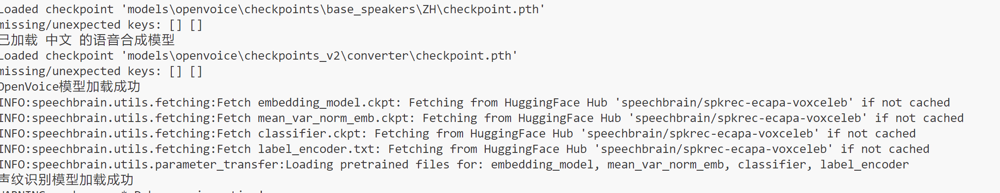
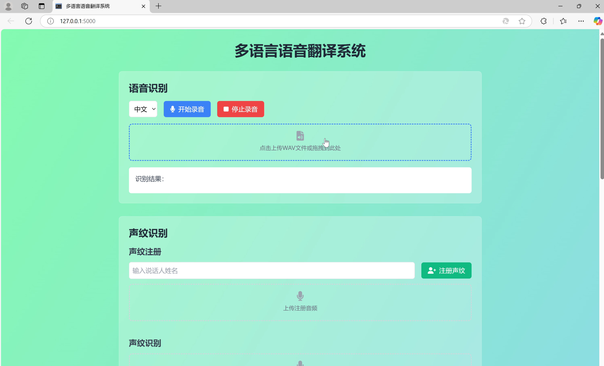

# 多语言语音翻译系统

这是一个基于 Flask 的多语言语音翻译系统，集成了语音识别、声纹识别、文本翻译和语音合成等功能。系统支持英语、法语和中文三种语言之间的互译。

## 功能特点

### 1. 语音识别
- 支持实时录音识别
- 支持上传 WAV 格式音频文件
- 支持拖拽上传音频文件
- 支持英语、法语和中文三种语言的识别

### 2. 声纹识别
- 声纹注册功能
- 声纹识别功能
- 支持上传音频文件进行声纹验证
- 显示声纹识别的置信度

### 3. 文本翻译
- 支持英语、法语和中文三种语言之间的互译
- 实时翻译功能
- 自动填充翻译结果

### 4. 语音合成
- 支持多种语音风格（默认、友好、愉快、兴奋、悲伤、愤怒、害怕、大声、耳语）（仅支持英语）
- 可调节语速（0.5-2.0倍速）
- 支持自定义音色（通过上传参考音频）
- 支持英语和中文的语音合成

## 技术栈

### 后端
- Python 3.9
- Flask Web 框架
- Vosk 语音识别
- MarianMT 机器翻译
- OpenVoice 语音合成
- SpeechBrain 声纹识别
- PyTorch
- librosa 音频处理

### 前端
- HTML5
- CSS3 (Tailwind CSS)
- JavaScript (原生)
- Font Awesome 图标

## 安装说明

1. 克隆项目到本地：
```bash
git clone https://github.com/bob-po/transformer_voice_system.git
cd transformer_voice_system
```

2. 安装 ffmpeg（用于音频处理）：
```bash
conda install ffmpeg
```

3. 安装 Python 依赖：
```bash
pip install -r requirements.txt
```

4. 下载必要的模型文件：
- Vosk 语音识别模型
- MarianMT 翻译模型
- OpenVoice 语音合成模型
- SpeechBrain 声纹识别模型

5. 将模型文件放置在正确的目录结构中：
```
models/
├── vosk-model/
│   ├── vosk-model-small-en-us/
│   ├── vosk-model-small-fr/
│   └── vosk-model-small-cn/
├── translation/
├── speaker_recognition/
└── openvoice/
    └── checkpoints/
```

6. ⚠️ 重要提示：运行应用前请确保：
   - 已开启 VPN 或代理服务
   - 确保可以访问 HuggingFace Hub
   - 由于大部分加载模型是本地的，但是有些默认配置需要访问huggingface下载模型，无法直接访问本地
   
   

7. 运行应用：
```bash
python app.py
```

8. 访问系统：
打开浏览器访问 `http://localhost:5000`



## 使用说明

### 语音识别
1. 选择识别语言
2. 点击"开始录音"按钮进行实时录音
3. 或点击上传区域选择/拖拽 WAV 格式音频文件
4. 等待识别结果显示

### 声纹识别
1. 声纹注册：
   - 输入说话人姓名
   - 上传注册音频
   - 点击"注册声纹"按钮

2. 声纹识别：
   - 上传待识别音频
   - 点击"识别声纹"按钮
   - 查看识别结果和置信度

### 文本翻译
1. 选择源语言和目标语言
2. 在左侧文本框输入要翻译的文本
3. 点击"翻译"按钮
4. 在右侧查看翻译结果

### 语音合成
1. 选择合成语言
2. 选择语音风格
3. 调节语速（可选）
4. 上传参考音色（可选）
5. 输入要合成的文本
6. 点击"合成语音"按钮
7. 使用音频播放器播放合成结果

## 注意事项

1. 音频文件格式要求：
   - 语音识别仅支持 WAV 格式
   - 声纹识别和语音合成支持常见音频格式

2. 系统要求：
   - 支持 CUDA 的 GPU 可提升性能
   - 建议使用现代浏览器（Chrome、Firefox、Edge 等）

3. 模型文件：
   - 首次运行需要下载模型文件
   - 模型文件较大，请确保有足够的存储空间

## 常见问题

1. 语音识别不准确：
   - 检查音频质量
   - 确保选择了正确的语言
   - 检查音频格式是否符合要求

2. 声纹识别失败：
   - 确保音频清晰度
   - 检查音频长度是否足够
   - 验证说话人是否已注册

3. 语音合成问题：
   - 检查文本语言是否与选择的合成语言匹配
   - 确保参考音色音频质量良好

## 贡献指南

欢迎提交 Issue 和 Pull Request 来帮助改进项目。在提交代码前，请确保：

1. 代码符合项目的编码规范
2. 新功能有适当的测试覆盖
3. 更新相关文档

## 许可证

本项目采用 MIT 许可证。详见 LICENSE 文件。 
